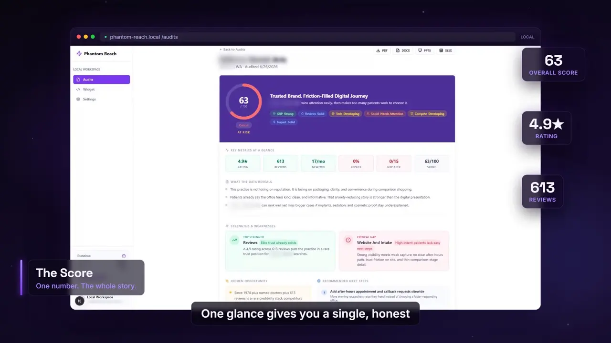
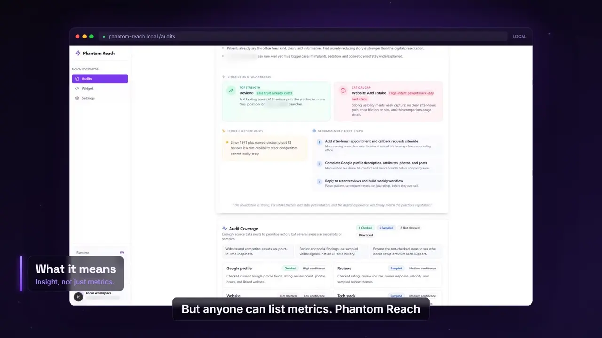
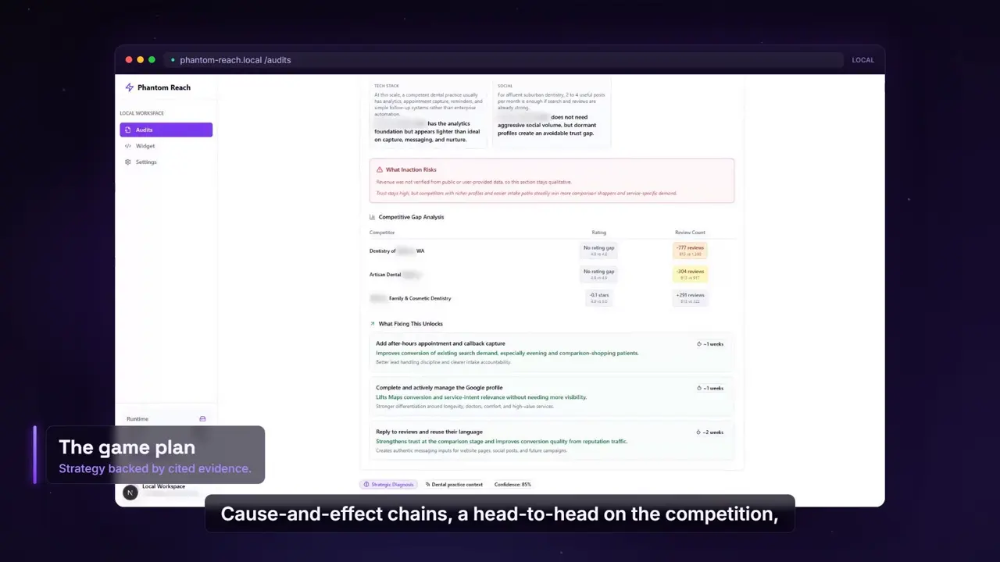

# Phantom Reach

> **Turn any local business into a $500 consultant-grade audit in minutes — on your own machine, with no fake data and no SaaS bill.**

[](LICENSE)
[](https://nodejs.org)
[](https://nextjs.org)
[](https://www.typescriptlang.org)
[](https://github.com/sponsors/calesthio)

Type a business name. Phantom Reach pulls its real public footprint — Google Business Profile, reviews, competitors, site speed, technology stack, social presence, and more — then hands it to a frontier AI model that reasons like a seasoned growth consultant and writes the report for you. Pitch-ready PDF, DOCX, PPTX, or XLSX, every time.

It runs **entirely on your machine**: local SQLite storage, keys managed from an in-app Settings page, and **zero synthetic data** — if a source key is missing, that module is honestly reported as unavailable instead of faked. No Supabase, no Stripe, no cloud lock-in.

And because everything lives in plain local files, you can hand the whole project to your AI coding assistant and tell it to run audits, dig deeper, and write follow-up research for you. [Jump to the agentic workflow ↓](#-agentic-by-design--your-coding-assistant-does-the-work)

## Watch the 2-Minute Explainer

https://github.com/user-attachments/assets/78224126-d53f-4f08-8e36-1ffc06b2a618

## Sample Report Preview

Screenshots from the explainer use blurred demo data, so they show the report quality without exposing a real business.

| Score overview | Strategy signals | Action plan |
| --- | --- | --- |
|  |  |  |

## Why Phantom Reach

- 🧠 **Consultant in a box** — a frontier model turns raw signals into strategic findings, not just a score.
- 🔒 **Local-first & private** — your data and keys never leave your machine.
- ✅ **Truth over theater** — real sources only; missing data is labeled, never invented.
- 📄 **Client-ready in one click** — export polished PDF/DOCX/PPTX/XLSX deliverables.
- 🤖 **Agent-ready** — built to be driven by your coding assistant end to end.
- 💸 **No SaaS tax** — open source, AGPL-licensed, run it free forever.

## Features

- **Multi-module digital audit** — Google Business Profile, reviews, competitors, PageSpeed/performance, social presence, technology stack, and business enrichment.
- **AI executive analysis** — bring your own OpenAI, Anthropic, or Google AI key and a frontier model synthesizes the data into a consultant-style narrative.
- **Local-first** — SQLite storage, no Supabase/SaaS required for normal use.
- **In-app key management** — add and test data-source keys from `/settings`, no restart needed.
- **Truthful coverage** — missing keys mark a source unavailable; never synthetic fallback data.
- **Multi-format exports** — PDF, DOCX, PPTX, and XLSX for any completed report.
- **Agent-friendly by design** — readable report JSON and a documented playbook so AI assistants can run and extend audits.

## Quick Start

Prerequisite: [Node.js](https://nodejs.org) 20 or newer.

```bash
npm run local
```

This prepares the local workspace, installs dependencies if needed, initializes SQLite, clears stale Next.js dev assets, and starts the app at:

```text
http://127.0.0.1:3000
```

Common pages:

- `/audits` — audit history
- `/audits/new` — run a new audit
- `/audits/{reportId}` — rendered audit report
- `/settings` — API keys and local workspace settings

## Configuration

Add and test keys at `/settings` → Data Sources, or set them as environment variables (copy [.env.example](.env.example) to `.env.local`). Updating keys in the UI does not require a restart.

| Key | Powers | Required |
| --- | --- | --- |
| `GOOGLE_PLACES_API_KEY` | Business lookup, Google profile, reviews, competitors | Recommended |
| `GOOGLE_PAGESPEED_API_KEY` | PageSpeed / Lighthouse performance data | Optional |
| `GOOGLE_CRUX_API_KEY` | Chrome UX Report field data | Optional |
| `CENSUS_API_KEY` | ZIP-level Census enrichment | Optional |
| `OPENCORPORATES_API_TOKEN` | Public business filing enrichment | Optional |
| `OPENAI_API_KEY` / `ANTHROPIC_API_KEY` / `GOOGLE_AI_API_KEY` | AI executive summary synthesis | Optional |

If a key is missing, the related module is reported as unavailable rather than guessed.

## 🧠 AI Intelligence That Reads Like a $300/hr Consultant

**Anyone can list metrics. Phantom Reach explains what they *mean*.**

The collectors gather the facts; a **frontier model** (your choice of GPT, Claude, or Gemini) turns those facts into the kind of analysis a senior growth strategist would charge a fortune for. Drop in an `OPENAI_API_KEY`, `ANTHROPIC_API_KEY`, or `GOOGLE_AI_API_KEY` and every verified signal is fed into the model to produce a report that *thinks*, not just tallies.

**What the intelligence layer delivers:**

- 📋 **Executive summary** — the whole story in 60 seconds, in plain English a business owner actually understands.
- 🔗 **Cause-and-effect findings** — it connects the dots across modules: *slow site + thin reviews + no Google posts → why your leads stall and your competitor's don't.*
- 🎯 **Prioritized, evidence-backed recommendations** — ranked by impact, each tied to a signal that was actually measured.
- 🕵️ **Hidden insights** — patterns a human skimming the data would miss, surfaced and explained.

**Why it's trustworthy:** the model reasons **only over real, cited data**. No hallucinated numbers. No invented revenue figures. No filler. If a fact wasn't collected, it isn't claimed.

> No AI key? The audit still runs and renders the full data-driven report — the narrative layer simply stays off. Your facts are never blocked behind a paywall.

## 🤖 Agentic by Design — Your Coding Assistant Does the Work

**This isn't just an app you click through. It's a workspace your AI agent can run.**

Phantom Reach was built from the ground up to be **operated by an AI coding assistant** — Copilot, Claude, Cursor, Gemini, Aider, and friends. Every input is an API call, and every output lands in plain local files (SQLite rows and JSON), so an agent can drive the entire loop: *generate → inspect → critique → research → deliver* — while you stay in the conversation.

The repo ships with a canonical agent playbook, [AGENTS.md](AGENTS.md), that turns any assistant into a research-and-implementation operator. Out of the box it knows how to:

- 🚀 **Run audits for you** — kick off jobs through the UI or the `/api/audit` endpoint.
- 🔍 **Read and inspect reports** — pull results straight from `data/phantom-reach.db` or `/api/report/{id}`.
- 🧹 **Critique report quality** — flag unsupported claims, stale citations, and weak recommendations before a client ever sees them.
- 🌐 **Go deeper on command** — run focused public research and cite sources when you want more intelligence than the audit gathered.
- 📦 **Ship supplemental work** — save extracts, research writeups, and screenshots into `output/`.

**Works with whatever you already use.** Tool-specific pointers — `CLAUDE.md`, `GEMINI.md`, `.aider.conf.yml`, `.github/copilot-instructions.md`, plus `.cursor/` and `.continue/` rules — all route back to the same playbook, so every assistant starts with identical context.

**Try it.** Open the repo in your AI assistant and just ask:

> *"Run an audit for Bellevue Dental Arts in Bellevue, WA, read the report, then tell me the three weakest parts of their digital presence with sources — and draft a one-page pitch on how we'd fix them."*

Then watch it run the audit, read the JSON, and write the deliverable for you.

## API

Generate an audit:

```bash
curl -X POST http://127.0.0.1:3000/api/audit \
  -H "Content-Type: application/json" \
  -d '{"businessName":"Bellevue Dental Arts","city":"Bellevue","state":"WA"}'
```

The response includes a `reportId`. Fetch the report:

```bash
curl http://127.0.0.1:3000/api/report/{reportId}
```

List reports:

```bash
curl "http://127.0.0.1:3000/api/reports?type=audit"
```

Export a completed report — append `/pdf`, `/docx`, `/pptx`, or `/xlsx`:

```text
/api/report/{reportId}/pdf
```

## Tech Stack

- **Framework**: Next.js 15 (App Router), React 18, TypeScript 5
- **Storage**: SQLite via `better-sqlite3`
- **Styling**: Tailwind CSS
- **Exports**: `@react-pdf/renderer`, `docx`, `pptxgenjs`, `exceljs`
- **AI (optional)**: OpenAI, Anthropic, Google GenAI SDKs
- **Testing**: Vitest, Playwright

## Project Structure

```text
src/
  app/                  Next.js routes (audits, settings, API)
  components/           UI components
  lib/
    agents/             Audit orchestrator and data collectors
      tools/            Per-source collectors (places, reviews, pagespeed, ...)
      prompts/          AI prompts
    reports/            Report content contract and coverage
    db/                 Local SQLite implementation and shared types
testing_framework/      Regression tests and smoke checks
```

## Development

```bash
npm run dev            # Next.js dev server
npm test               # Vitest unit/integration tests
npm run verify:local   # Type-check + tests + Playwright smoke on /audits and /settings
npx tsc --noEmit       # Type-check only
```

`npm run verify:local` starts a temporary dev server on port 3100 and writes Playwright screenshots to `output/playwright/`.

## Troubleshooting

- **Port 3000 in use** — `npm run local` restarts an old Phantom Reach dev server automatically. If another app holds the port, close it first.
- **Unstyled HTML** — run `npm run local`; the local runner clears stale Next.js assets before startup.

## Security & Privacy

The app stores secrets and data locally. These are gitignored — never commit them:

- `.env.local` — your API keys
- `.phantom-reach/instance.key` — encrypts saved keys
- `data/phantom-reach.db` — reports, settings, and the local workspace user

## License

Licensed under the [GNU Affero General Public License v3.0](LICENSE).

AGPL-3.0 is a strong network-copyleft license: if you run a modified version of this software as a network service, you must make your modified source available to its users. See the [LICENSE](LICENSE) file for the full terms.

---

**Phantom Reach** turns local business research into client-ready intelligence reports, on your own machine.

If this project looks useful to you, a GitHub star would mean a lot. It helps marketers, agencies, and builders discover the project.

If you would like to support the work more directly, [sponsor the project](https://github.com/sponsors/calesthio). Phantom Reach is built in public, and sponsorship helps keep the open-source version moving.
